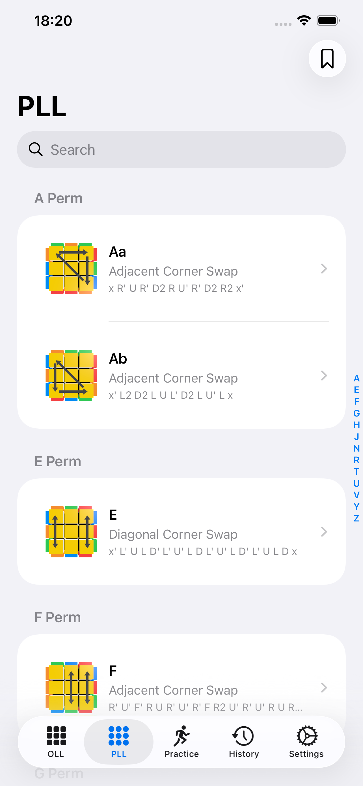
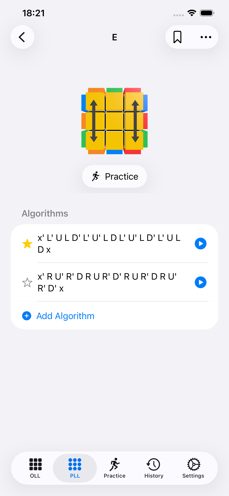
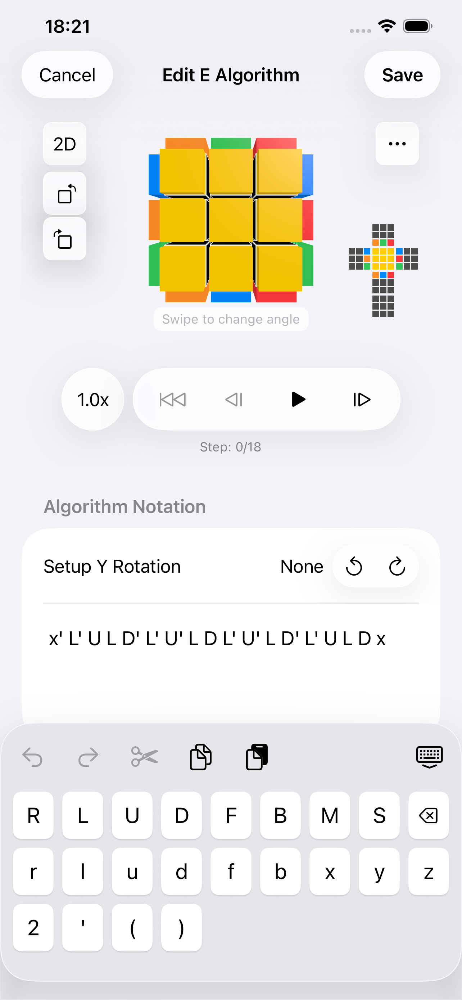
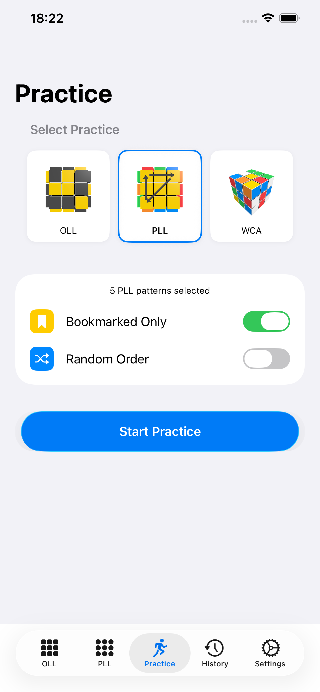
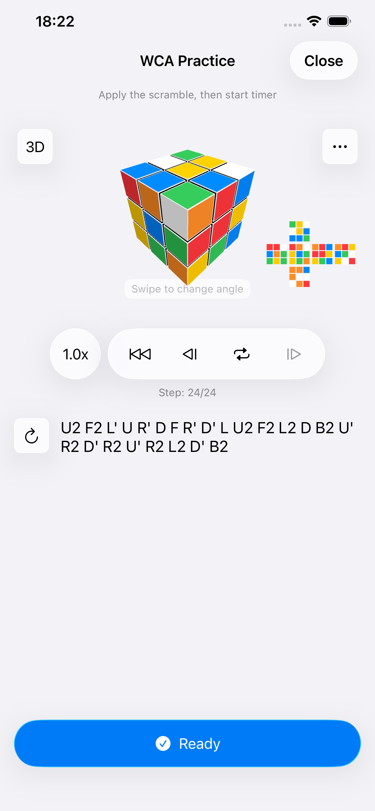

#  CubeAlg Viewer

A speedcubing algorithm reference app for iPhone, iPad, and Mac.

<!-- TODO: replace with real App Store link once published -->
<!--  -->

---

## What it does

CubeAlg Viewer helps speedcubers learn and practice OLL and PLL algorithms with interactive 3D visualization.

**Browse & learn**
- 57 OLL and 21 PLL patterns with visual previews
- Step-by-step algorithm playback on a 3D cube
- Swipe to rotate the cube to any viewing angle
- Group OLL patterns by dot count, shape, or number

**Manage your algorithms**
- Add your own algorithm variations per pattern
- Algorithm editor with a custom notation keyboard and live 3D preview
- Bookmark patterns to focus your practice
- Search patterns by name, shape, or bookmark status
- Import/export algorithm collections (YAML format)

**Practice modes**
- Drill bookmarked OLL/PLL patterns in sequence or random order
- WCA timed solves with random WCA scrambles
  - Full solve history - retry any past scramble, edit recorded times
  - Ao5, Ao50, Ao100 averages
  - Import/export solve history (CSV format)

---

## Screenshots

---

## Privacy

All data is stored locally on your device. No accounts, no tracking, no analytics. See [privacy policy](privacy-policy.md).

## Support

[support.md](support.md) - email appsfeedback@monemone.org
